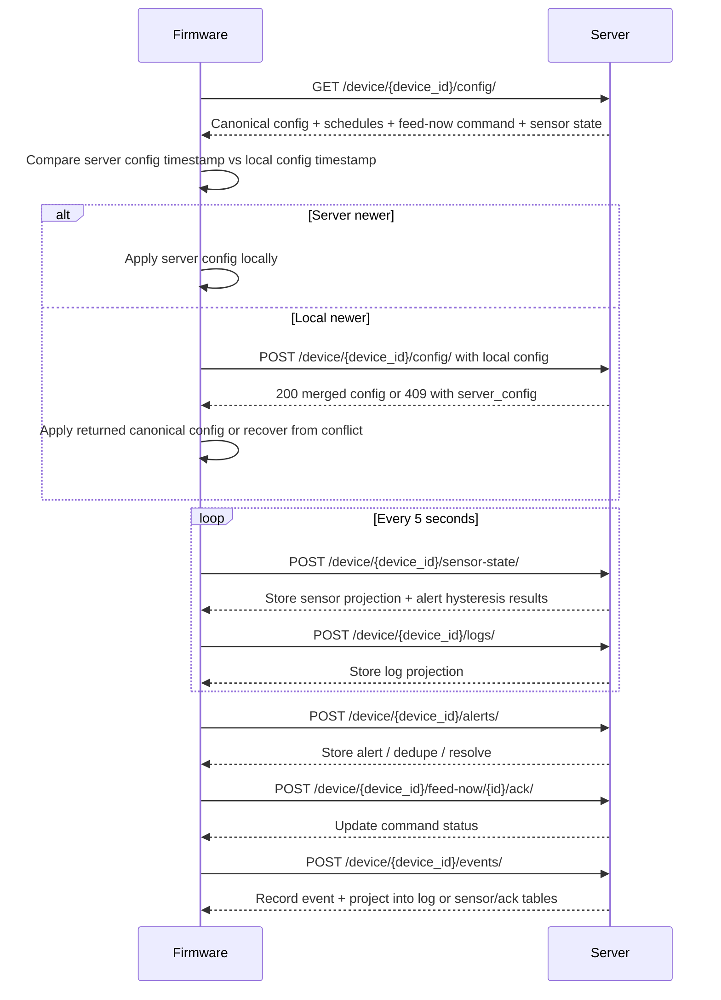

# Firmware-Server Interaction Reference

This document describes how the ESP32 firmware in `IOTFirmwaremk1` interacts with the Django server in `server/iot`, based on the current code.

It is intentionally exhaustive. It covers the happy path, retries, deduplication, stale data recovery, conflict resolution, and failure modes that are already implemented or implied by the current behavior.

## High-Level Model

The system is a bidirectional sync loop.

The firmware:
- polls the server for device configuration every 5 seconds,
- sends sensor state every 5 seconds,
- sends heartbeat logs every 5 seconds,
- sends event logs when local behavior occurs,
- sends alerts when safety or environmental conditions occur,
- acknowledges feed-now commands after execution or rejection,
- buffers important outbound traffic when the network is unavailable.

The server:
- authenticates the device with a per-device token,
- stores device configuration and merges server-owned and device-owned fields,
- records logs, alerts, sensor state, and event projections,
- deduplicates retries using deterministic event IDs,
- reconciles feed-now commands with acknowledgements,
- auto-resolves some alerts and connection-loss conditions.

## End-to-End Flow

## Authentication

Device-authenticated requests use a simple token header:

- `Authorization: Token <auth_token>`

The server validates that token against the `Device` row with the matching `device_id`.

Important properties:
- The header is mandatory for all firmware-originated writes.
- There is no device-side session or cookie auth.
- The token is checked only on the device routes that call `authorize_device`.
- If the token is missing or wrong, the server returns `401 Unauthorized`.

The current firmware hardcodes the following connection values in `include/sf_config.h`:
- server base URL,
- device ID,
- auth token,
- Wi-Fi credentials.

That means device identity and transport credentials are build-time configuration, not dynamically provisioned at runtime.

## Firmware Timing

The firmware loop has several independent timers:

- config sync every 5 seconds,
- sensor upload every 5 seconds,
- heartbeat log every 5 seconds,
- Wi-Fi reconnect every 15 seconds,
- water refill check every 5 minutes,
- schedule evaluation every 60 seconds,
- main loop delay of 20 ms.

The exact constants are defined in `include/sf_config.h` and used from `src/main.cpp`.

This matters because the firmware is not event-driven for all server communication. Some actions are immediate, but most status updates are periodic and may be delayed if Wi-Fi is down or the server is unreachable.

## Core Request Paths

### 1. Device Configuration Sync

Firmware behavior:
- `syncWithServer()` in `src/sf_network.cpp` runs from the main loop every sync interval.
- It performs a GET request to `/device/{device_id}/config/`.
- It compares the returned server config timestamp against the local cached config timestamp.
- If the server config is newer, the firmware applies it locally.
- If the local config is newer, the firmware posts the local copy back to the server.

Server endpoint:
- `GET /device/<device_id>/config/`
- `POST /device/<device_id>/config/`

Server response shape on GET:
- canonical device config,
- server time metadata,
- current schedules,
- current sensor state,
- pending feed-now command if one exists,
- runtime values such as threshold mirrors and derived values.

### 2. Logs

Firmware behavior:
- `sendLog(type, payload)` posts JSON to `/device/{device_id}/logs/`.
- If the POST fails and the log is not a heartbeat, the firmware queues it for later retry.
- Heartbeat logs are intentionally not buffered on failure.

Server endpoint:
- `POST /device/<device_id>/logs/`
- `GET /device/<device_id>/logs/`

### 3. Alerts

Firmware behavior:
- `sendAlert(alertType)` posts to `/device/{device_id}/alerts/`.
- Failed alerts are queued for retry.

Server endpoint:
- `POST /device/<device_id>/alerts/`
- `GET /device/<device_id>/alerts/`

### 4. Sensor State

Firmware behavior:
- `reportSensorLevels()` posts feeder level, water level, battery voltage, mains state, and timestamp to `/device/{device_id}/sensor-state/`.
- Failed sensor reports are queued for retry.
- The firmware clamps feeder and water readings to the range 0 to 100 before sending them.

Server endpoint:
- `POST /device/<device_id>/sensor-state/`
- `GET /device/<device_id>/sensor-state/`

### 5. Feed-Now Commands

Server side:
- staff users can create commands with `POST /device/<device_id>/feed-now/`.
- the server limits the number of pending commands to 5.
- the command amount must not exceed the computed maximum single-feed amount for the device.

Firmware side:
- the firmware reads the pending command from the config payload.
- it executes the command once, stores the last processed command ID locally, and sends an acknowledgement to `/device/{device_id}/feed-now/{command_id}/ack/`.
- acknowledgements are also buffered if the network is down.

### 6. Event Ingest

The firmware can send batch event data to:
- `POST /device/<device_id>/events/`

This route is more general than logs. It can project incoming data into sensor state, feed-now acknowledgements, or logs depending on the event type.

## Device Configuration Contract

### GET /device/{device_id}/config/

The server returns a merged payload that includes several layers of data:

- persisted `DeviceConfig.config`,
- canonical schedule rows serialized into `config.schedules`,
- system timezone mirrored into `config.system_timezone`,
- effective max capacity fields,
- derived `max_single_feed_kg`,
- effective feeder and water thresholds,
- alert thresholds,
- low-battery shutdown voltage,
- total feed tally default,
- pending feed-now command,
- live sensor state.

The firmware uses this as the authoritative server snapshot for reconciliation.

### POST /device/{device_id}/config/

This route has two distinct modes.

#### Device-authenticated mode

The firmware uses this when it has a valid token header.

Required payload fields:
- `config`
- `last_updated`

The server rejects missing or invalid timestamps.

Server-side merge rules:
- if the incoming timestamp is not newer than the stored server timestamp, the server returns `409 Conflict` with the current `server_config`.
- if the incoming timestamp is newer, the server accepts the update.
- schedule data in the payload is normalized into canonical `Schedule` rows.
- threshold fields in the payload can update global system settings.
- battery and keypad fields are preserved or merged as needed.
- `grain_type_index` conflicts are resolved in favor of the grain name when the two disagree.

The server also preserves or reconstructs several values:
- `system_timezone`,
- effective threshold mirrors,
- low-battery shutdown threshold,
- `total_feeds_today_kg`,
- `max_single_feed_kg`.

#### Admin-authenticated mode

If the request is not device-authenticated but the request user is an authenticated staff user, the server treats it as a management push.

Behavior:
- only staff users may use this path,
- the request must contain a `config` object,
- the server applies system-wide threshold and schedule synchronization,
- `updated_by` is set to `server`.

This path exists so the web UI can push device config without the firmware token.

## Local vs Server Conflict Resolution

The firmware uses last-write-wins logic, but with a special conflict recovery path.

### Server newer than local

If the server timestamp is newer, the firmware:
- applies the returned server config locally,
- preserves local-only battery, keypad, and derived feed-limit fields when the server omits them,
- keeps the canonical grain calibration set from the server.

### Local newer than server

If the local config is newer, the firmware:
- posts the local config back to the server,
- includes its local timestamp,
- preserves server-owned grain calibration data before posting,
- waits for either a successful canonical response or a conflict response.

If the server returns `409 Conflict` and includes `server_config`, the firmware applies that server copy locally.

### Equal timestamps

If the timestamps are equal, the firmware treats the configs as in sync and does nothing.

## Firmware-Side Preservation Rules

Before applying a server config, the firmware preserves local fields when the server omitted them:

- battery sensing configuration,
- keypad enablement and keypad calibration,
- locally derived `max_single_feed_kg`,
- local grain selection fields when server data does not include them.

It also preserves server-owned grain calibration data when pushing local changes.

This means the firmware config is not a blind overwrite. It is a merge between server-owned and device-owned responsibilities.

## Logs

### Log Payload

The firmware sends:

- `log_type`
- `payload`
- `timestamp`

The server accepts optional event metadata when present:

- `event_id`
- `request_id`
- `boot_id`
- `sequence`
- `source`

### Server Projection Behavior

The server does not always create a brand-new log row.

For some log types, it stacks entries as distinct rows.
For others, it refreshes the latest matching row and increments `refresh_count`.

Current behavior:
- `feeding`, `device_connection_loss`, and `device_connection_restored` stack as independent log rows.
- most other log types refresh the newest row of that type.

### Important Log Notification

If a log is new and not refreshed, and it matches the important-log keyword rules, the server may email notifications.

The keywords come from system settings, and a default keyword list is used when no custom list exists.

## Alerts

### Firmware-triggered alert types

The firmware currently sends at least these alert types:

- `low_feed`
- `low_water`
- `power_outage`
- `power_restored`
- `low_battery_shutdown`
- `feed_now`-related status flows are not alerts, but the device may also send feed-now acknowledgements and logs.

### Server alert behavior

The server handles several alert families differently.

#### Low feed and low water

These are usually triggered by sensor state ingestion.

- `low_feed` is created when feeder level falls below the low threshold.
- `low_water` is created when water level falls below the low threshold.
- Existing unresolved alerts are refreshed rather than duplicated.
- When readings recover above the recovery threshold, unresolved alerts are auto-resolved.

#### Power outage and restore

The server debounces `power_outage` and `power_restored` using a fixed window.

If a duplicate arrives within the debounce window:
- the server does not create a second alert,
- the server may mark the original outage as resolved when a restore is received,
- the server may update or create a corresponding log row.

#### Low battery shutdown

This path has special handling.

The server:
- deduplicates repeat shutdown alerts within 45 seconds,
- stores a shutdown alert payload,
- creates a shutdown log projection,
- auto-resolves stale shutdown alerts after a short grace period,
- creates a second resolved alert record when a shutdown alert is auto-resolved.

The firmware also sends a power log when it asserts the shutdown relay.

## Sensor State Ingestion

The firmware sends sensor state on a periodic timer and also as part of some internal flows.

Payload fields accepted by the server include:
- `feeder_level_pct`
- `water_level_pct`
- `battery_voltage_v`
- `feed_sufficient`
- `feed_current_kg`
- `feed_required_next_kg`
- `mains_power_present`
- `timestamp`

Server behavior:
- missing feeder or water values return `400 Bad Request`,
- non-numeric feeder or water values return `400 Bad Request`,
- sensor levels are clamped to 0 to 100,
- duplicate sensor events are deduplicated using the event recorder,
- the server updates the `DeviceSensorState` row,
- the server runs low-feed and low-water hysteresis checks after a successful update.

### Hysteresis Rules

The server uses low and recovery thresholds.

Low-side crossing:
- if feeder level is at or below the low threshold, a `low_feed` alert is created or refreshed,
- if water level is at or below the low threshold, a `low_water` alert is created or refreshed.

Recovery:
- when feeder level rises to or above the recovery threshold, unresolved `low_feed` alerts are resolved,
- when water level rises to or above the recovery threshold, unresolved `low_water` alerts are resolved.

This means the same low sensor condition can generate multiple refreshes but should not create duplicate unresolved alerts.

## Feed-Now Commands

### Creation

The server only allows staff users to create feed-now commands.

Rules:
- `amount_kg` must be positive,
- the amount must not exceed the device's computed single-feed maximum,
- there can be at most 5 pending commands per device.

### Delivery to firmware

The current pending command is included in the config GET response as `config.feed_now_command`.

The firmware processes that command from local config state rather than from a separate push channel.

### Device acknowledgement

The firmware acknowledges the command with:
- `status = executed` or `failed`,
- optional `reason`,
- optional event metadata.

Server behavior:
- acknowledgements are recorded as device events,
- if the command is already non-pending, the ack is treated as a duplicate and does not reapply state,
- if the command is still pending, the status is updated,
- a failed execution stores a truncated failure reason,
- the acknowledgement endpoint can also be reached through batch event ingest as a projection.

### Firmware deduplication

The firmware stores the last acknowledged command ID locally.

If the same command ID appears again, the firmware will not re-run the motor.

That dedupe is important because network retries, config replay, or stale cached config can otherwise trigger duplicate dispensing.

## Event Ingest

`POST /device/{device_id}/events/` is the most general ingestion route.

It accepts either:
- a single event object,
- or an object containing `events: [...]`.

Supported projections:
- sensor state,
- feed-now acknowledgements,
- logs.

### General Event Rules

Each event may include:
- `event_type`, `type`, or `log_type` to identify the event,
- `payload`,
- `occurred_at` or `timestamp`,
- `event_id` or `request_id`,
- `boot_id`,
- `sequence`,
- `source`.

The server processes each item independently and returns a per-item result list.

### Event Deduplication

The server builds deterministic event IDs in this order:

1. explicit `event_id`,
2. `device_id + boot_id + sequence + event_type` if boot ID and sequence are available,
3. a hash over device ID, event type, timestamp, boot ID, sequence, source, and payload.

This gives the server a stable dedupe mechanism even when the network retries the same payload.

## Outbound Buffering on the Firmware

The firmware has a persistent outbox for unreliable network conditions.

The outbox stores queued requests in preferences and uses a sequence counter so pending items survive resets.

### What gets buffered

Buffered categories include:
- important logs,
- alerts,
- sensor state,
- feed-now acknowledgements.

### What does not get buffered

- heartbeat logs are intentionally dropped if they fail,
- if a request body is empty, it is not queued,
- if the device is offline and a request cannot even be formed, nothing is queued.

### Queue pressure behavior

The queue is capped at 20 entries.

If the queue is full:
- a non-critical event is dropped first whenever possible,
- if all entries are critical, the oldest entry is removed to preserve a newer critical event,
- sensor state is special-cased so that a queued sensor sample is replaced rather than duplicated.

### Flush behavior

The firmware tries to flush up to two buffered events per loop pass when Wi-Fi is available.

This is a deliberate throttle. It prevents the device from spending all of its loop time draining the outbox after a long outage.

## Network Reachability and Backoff

The firmware does not blindly attempt HTTP if the server is unreachable.

Behavior:
- it checks Wi-Fi first,
- it probes the server host before calling HTTPClient,
- if the server is unreachable, it enters a cooldown window,
- during the cooldown, it skips additional probes.

This reduces blocking behavior in the main loop.

If Wi-Fi is down:
- the firmware continues local control where possible,
- sync and uploads are skipped,
- retries happen after the reconnect interval.

## Boot and Safety Behavior

On boot, the firmware:
- initializes GPIO and peripherals,
- connects Wi-Fi non-blockingly,
- starts OTA if Wi-Fi is present,
- attempts NTP time sync,
- loads local config,
- reconciles power state from persistent storage,
- loads queued outbound events,
- initializes sensor and control-loop state.

### Low Battery Shutdown

This is one of the most important safety paths.

When battery voltage falls below the shutdown threshold:
- the firmware marks shutdown as pending,
- flushes buffered outbound items if possible,
- sends a `low_battery_shutdown` alert,
- sends a `power` log with shutdown metadata,
- opens the shutdown relay,
- stops normal action after the shutdown service returns true.

On the server side:
- the shutdown alert may be refreshed if repeated quickly,
- stale shutdown alerts are auto-resolved after a short grace period,
- a resolved alert row and resolved log projection are created when auto-resolved.

## Connection Monitoring

The server maintains device connection status using recent device activity.

Whenever the server sees a sensor report, log, event batch, or feed-now acknowledgement:
- it updates `Device.last_seen`,
- it marks the device connected,
- if the device was previously disconnected, it creates a restoration alert/log.

If heartbeat monitoring determines that a device has been silent too long:
- the server marks it disconnected,
- it creates a connection-loss alert,
- it writes a connection-loss log projection.

This means connectivity is inferred from traffic, not from a dedicated ping endpoint.

## Practical Edge Cases

### 1. Server is up but the token is wrong

Result:
- device writes are rejected with `401 Unauthorized`,
- the firmware sees the failure as a network/API error,
- buffered retry may still happen, but the same token problem will continue until the firmware is re-flashed or the device record is corrected.

### 2. Device config GET works but POST conflicts

Result:
- the firmware posts its local config,
- the server responds with `409 Conflict` and `server_config`,
- the firmware applies the server copy locally.

This prevents silent divergence when the server has already been updated elsewhere.

### 3. Duplicate log or event retries

Result:
- the server’s event ID logic collapses duplicates,
- existing log rows may be refreshed instead of duplicated,
- sensor projections and ack projections are idempotent where possible.

### 4. Sensor payload is partial or malformed

Result:
- missing feeder or water values cause a 400 error,
- non-numeric values cause a 400 error,
- valid values are clamped to safe ranges.

### 5. Sensor values are valid but out of range

Result:
- the server clamps to 0 to 100,
- alerts are still evaluated against the clamped values.

### 6. Heartbeat log upload fails

Result:
- it is not queued,
- no retry entry is created,
- device connectivity may still be inferred from later traffic.

### 7. Non-heartbeat log upload fails

Result:
- the log is queued if there is room,
- it is retried later,
- important logs are prioritized by the outbox rules.

### 8. Queue is full during an outage

Result:
- the firmware drops less important data first,
- sensor state is replaced rather than piled up,
- critical alerts and acknowledgements are preserved when possible.

### 9. Feed-now command is stale

Result:
- the firmware ignores commands with IDs less than or equal to the locally persisted last-acknowledged command ID,
- the motor is not run twice,
- duplicate acknowledgements are also harmless on the server.

### 10. Feed-now command is invalid or cannot be executed

Result:
- the firmware still sends an acknowledgement with `failed`,
- the server updates the command status,
- a failure reason may be stored,
- a log entry is still produced so the failure is visible.

### 11. Wi-Fi is unavailable at boot

Result:
- NTP may be skipped,
- OTA setup is delayed,
- config sync and uploads are skipped until reconnect,
- local control continues.

### 12. Server returns malformed JSON

Result:
- the firmware rejects the payload and logs the parse failure,
- no local config update is applied,
- the next sync cycle retries.

### 13. Local config file is malformed

Result:
- the firmware logs the parse failure,
- config reconciliation is skipped,
- the device continues using empty/default config until the file is repaired or replaced.

### 14. Shutdown alert repeats rapidly

Result:
- the server deduplicates the alert within the debounce window,
- the existing alert refresh count increases instead of creating duplicate records,
- the associated log may also be refreshed.

### 15. A shutdown alert never gets an explicit recovery signal

Result:
- the server auto-resolves it after the configured grace period,
- the resolution is recorded server-side even if the device never sent a resolved event.

## Operational Summary

The architecture is resilient but not overly abstracted:

- firmware owns real-time control and local buffering,
- server owns canonical history, user-facing state, and deduplication,
- config is periodically reconciled in both directions,
- safety events are written as logs and alerts so they can be audited later,
- device-level retries are tolerated because the server is designed to collapse duplicates instead of multiplying them.

In practice, the most important guarantees are:
- no duplicate feed-now execution from replayed config,
- no runaway duplicate alerts for common failure conditions,
- no silent loss of important outbound data when the network drops,
- server wins on configuration conflicts unless the device has a clearly newer local timestamp and the server accepts the merge.

## Source Anchors

Relevant firmware files:
- `IOTFirmwaremk1/src/main.cpp`
- `IOTFirmwaremk1/src/sf_network.cpp`
- `IOTFirmwaremk1/src/sf_scheduler.cpp`
- `IOTFirmwaremk1/src/sf_sensors.cpp`
- `IOTFirmwaremk1/src/sf_actuators.cpp`
- `IOTFirmwaremk1/include/sf_config.h`

Relevant server files:
- `server/iot/views.py`
- `server/iot/config_sync.py`
- `server/iot/models.py`
- `server/iot/serializers.py`
- `server/iot/urls.py`
