# Smart Feeder MK1 Comprehensive Function Flowchart

This document provides an extensive system-level flow chart of the device purpose, runtime behavior, feature set, and safety logic.

## Device Purpose

The firmware implements an autonomous connected feeding and watering controller that:
- Executes scheduled and on-demand feed dispensing.
- Monitors feeder level, water level, mains power, and battery voltage.
- Refills water using hysteresis thresholds.
- Synchronizes configuration and events with a backend server.
- Remains operable during network outages via local storage and buffered outbox.
- Exposes local and remote operator interfaces (LCD/keypad, serial, multi-port WiFi console).
- Enforces protection behavior such as low-battery shutdown relay assertion.

## Core Features Visualized

- Multi-interface control: USB serial + wireless command/debug/network/system/keypad consoles.
- Local-first persistence: Preferences-backed config, counters, calibration, and event queue.
- Time-based automation: periodic sync, schedule checks, sensor reports, heartbeat.
- Actuation pipelines: feed motor runtime by grain calibration, water solenoid refill control.
- Alert/event telemetry: critical alerts and typed logs with offline buffering.
- Safety systems: power-fail monitoring, low feed/water alerts, low-battery shutdown routine.

## End-to-End Firmware Flow

```mermaid
flowchart TD
  %% ============================
  %% PURPOSE AND CONTEXT
  %% ============================
  P0([System Purpose: Autonomous IoT feeding and watering controller])
  P1[[Inputs: Time, sensors, keypad, serial commands, network commands, server config]]
  P2[[Outputs: Feed motor, water solenoid, buzzer, LCD UI, cloud logs/alerts, shutdown relay]]
  P3[[Constraints: Intermittent WiFi, hardware noise, safety-critical low-battery handling]]

  P0 --> P1
  P0 --> P2
  P0 --> P3

  %% ============================
  %% BOOT / SETUP
  %% ============================
  S0([Boot: setup])
  S1[Serial begin and startup logs]
  S2[setupPins: configure trig/echo, motor, solenoid, buzzer, ADC, shutdown relay]
  S3[initAdcSystem]
  S4[Wire begin and LCD init]
  S5[initControlPanel]
  S6[connectWiFi]
  S7[reconcilePowerAlertStateOnBoot]
  S8[setupOTA]
  S9[setupTime via NTP]
  S10[ensureLocalDefaults]
  S11[reloadKeypadCalibration]
  S12[Initialize runtime timestamps and flags]
  S13[loadLocalConfig into cachedCfgStr]
  S14[readBufferedEventCount]
  S15[read mains state and reset low-battery shutdown state]
  S16[printSerialHelp]

  P1 --> S0
  S0 --> S1 --> S2 --> S3 --> S4 --> S5 --> S6 --> S7 --> S8 --> S9 --> S10 --> S11 --> S12 --> S13 --> S14 --> S15 --> S16

  %% ============================
  %% MAIN LOOP SKELETON
  %% ============================
  L0([Main loop tick])
  L1[serviceMultiWirelessConsole]
  L2[serviceOTA]
  L3[pollAdcHighPriority]
  L4[Safety guard: force feed motor OFF unless active dispense routine]
  L5[handleSerialCommands]
  L6{Serial console exclusive mode?}
  L7[delay 20ms and return early]

  S16 --> L0
  L0 --> L1 --> L2 --> L3 --> L4 --> L5 --> L6
  L6 -- yes --> L7 --> L0

  %% ============================
  %% CONNECTIVITY / POWER CHECKS
  %% ============================
  C0{WiFi connected?}
  C1{Reconnect interval elapsed?}
  C2[connectWiFi retry]
  C3{Mains monitor enabled and interval elapsed?}
  C4[handlePowerFailMonitoring]
  C5{Keypad enabled and poll interval elapsed?}
  C6[pollKeypad]
  C7{Sync interval elapsed?}
  C8[syncWithServer]
  C9[serviceBufferedOutbox]

  L6 -- no --> C0
  C0 -- no --> C1
  C1 -- yes --> C2
  C1 -- no --> C3
  C0 -- yes --> C3
  C2 --> C3
  C3 -- yes --> C4 --> C5
  C3 -- no --> C5
  C5 -- yes --> C6 --> C7
  C5 -- no --> C7
  C7 -- yes --> C8 --> C9
  C7 -- no --> C9

  %% ============================
  %% CONFIG LOAD / PARSE / REFRESH
  %% ============================
  F0{Refresh interval elapsed OR cache empty?}
  F1[cachedCfgStr = loadLocalConfig]
  F2{Schedule check interval elapsed?}
  F3[ensureDailyFeedTotalForToday]
  F4[Deserialize cached config JSON]
  F5{Parse error?}
  F6[Use empty/default config variant]
  F7[Extract schedules array]
  F8[serviceGrainTypeVerbose]
  F9[updateControlPanel]
  F10[processFeedNowCommand]

  C9 --> F0
  F0 -- yes --> F1 --> F2
  F0 -- no --> F2
  F2 -- yes --> F3 --> F4
  F2 -- no --> F4
  F4 --> F5
  F5 -- yes --> F6 --> F7
  F5 -- no --> F7
  F7 --> F8 --> F9 --> F10

  %% ============================
  %% SCHEDULING + FEED AUTOMATION
  %% ============================
  A0{Do schedule check now?}
  A1[checkLowFeedPrediction]
  A2[checkSchedulesAndExecute]
  A3{Current HH:MM already processed?}
  A4[Skip duplicate slot]
  A5[Match enabled schedules by time]
  A6{Feed sufficient for schedule amount?}
  A7[dispenseFeed]
  A8[sendAlert low_feed]

  F10 --> A0
  A0 -- yes --> A1 --> A2 --> A3
  A3 -- yes --> A4
  A3 -- no --> A5 --> A6
  A6 -- yes --> A7
  A6 -- no --> A8

  %% ============================
  %% SENSOR REPORT + HEARTBEAT
  %% ============================
  R0{Sensor report interval elapsed?}
  R1[reportSensorLevels]
  R2{Heartbeat enabled and interval elapsed?}
  R3[sendLog heartbeat]

  A4 --> R0
  A7 --> R0
  A8 --> R0
  A0 -- no --> R0
  R0 -- yes --> R1 --> R2
  R0 -- no --> R2
  R2 -- yes --> R3

  %% ============================
  %% WATER MANAGEMENT
  %% ============================
  W0{Water check interval elapsed?}
  W1[Read low/high thresholds and current water pct]
  W2{Not refilling and pct <= low?}
  W3[Set isRefilling true]
  W4[attemptRefill]
  W5{Refilling and pct >= high?}
  W6[Set isRefilling false]
  W7[sendLog refill_complete]

  R3 --> W0
  R2 -- no --> W0
  W0 -- yes --> W1 --> W2
  W2 -- yes --> W3 --> W4 --> W5
  W2 -- no --> W5
  W5 -- yes --> W6 --> W7
  W5 -- no --> B0
  W7 --> B0

  %% ============================
  %% BUZZER + LOW BATTERY SHUTDOWN
  %% ============================
  B0[serviceLevelErrorBuzzer]
  B1[serviceLowBatteryShutdown]
  B2{Low battery threshold crossed?}
  B3[Mark shutdown pending state]
  B4[Flush buffered outbox before shutdown]
  B5{Shutdown already triggered?}
  B6[sendAlert low_battery_shutdown]
  B7[sendLog power low_battery_shutdown payload]
  B8[Assert battery shutdown relay]
  B9[Return early from loop]
  B10[delay MAIN_LOOP_DELAY_MS and next tick]

  W5 -- yes --> B0
  B0 --> B1 --> B2
  B2 -- yes --> B3 --> B4 --> B5
  B5 -- no --> B6 --> B7 --> B8 --> B9 --> L0
  B5 -- yes --> B9 --> L0
  B2 -- no --> B10 --> L0

  %% ============================
  %% DISPENSE SUBFLOW
  %% ============================
  D0([DispenseFeed subflow])
  D1[playFeedingEventTone]
  D2{Simulation feed motor enabled?}
  D3[Virtual decrement remaining kg and simulated feeder pct]
  D4[Compute run_ms = startup_ms + amount_kg * grain_ms_per_kg]
  D5[setFeedMotorEnabled true]
  D6[delayWithKeypadPolling run_ms]
  D7[setFeedMotorEnabled false]
  D8[Update remaining kg]
  D9[addToDailyFeedTotalKg]
  D10[sendLog feeding]

  A7 --> D0
  D0 --> D1 --> D2
  D2 -- yes --> D3 --> D8
  D2 -- no --> D4 --> D5 --> D6 --> D7 --> D8
  D8 --> D9 --> D10 --> R0

  %% ============================
  %% REFILL SUBFLOW
  %% ============================
  RF0([attemptRefill subflow])
  RF1{Simulation refill enabled?}
  RF2[Increase simulated water pct]
  RF3[Open solenoid 4s]
  RF4[Close solenoid]
  RF5[Read water level pct]
  RF6{Water pct <= 5?}
  RF7[sendAlert low_water]
  RF8[sendLog watering refill]

  W4 --> RF0
  RF0 --> RF1
  RF1 -- yes --> RF2 --> RF5
  RF1 -- no --> RF3 --> RF4 --> RF5
  RF5 --> RF6
  RF6 -- yes --> RF7 --> B0
  RF6 -- no --> RF8 --> B0

  %% ============================
  %% FEED NOW COMMAND SUBFLOW
  %% ============================
  FN0([processFeedNowCommand subflow])
  FN1[Read feed_now_command from config]
  FN2{Valid command id and newer than persisted ack watermark?}
  FN3[Ignore invalid or duplicate command]
  FN4[Validate amount and limits]
  FN5{Simulation feed motor OR insufficient feed OR amount invalid?}
  FN6[Reject with reason]
  FN7[Execute dispenseFeed]
  FN8[sendFeedNowAck]
  FN9[Persist last feed_now command id]
  FN10[sendLog feed_now]

  F10 --> FN0
  FN0 --> FN1 --> FN2
  FN2 -- no --> FN3 --> A0
  FN2 -- yes --> FN4 --> FN5
  FN5 -- yes --> FN6 --> FN8
  FN5 -- no --> FN7 --> FN8
  FN8 --> FN9 --> FN10 --> A0

  %% ============================
  %% NETWORK SYNC SUBFLOW
  %% ============================
  N0([syncWithServer subflow])
  N1[HTTP GET device config envelope]
  N2{GET success and parse valid?}
  N3[Abort sync]
  N4[Load and parse local config]
  N5[Compare server and local last_updated timestamps]
  N6{server_ts > local_ts?}
  N7[Apply server envelope to local with preserved local-only fields]
  N8{local_ts > server_ts?}
  N9[POST local envelope to server]
  N10{POST success?}
  N11[Apply canonical config from response if present]
  N12[On conflict, apply server_config fallback]
  N13[No changes needed]

  C8 --> N0
  N0 --> N1 --> N2
  N2 -- no --> N3 --> C9
  N2 -- yes --> N4 --> N5
  N5 --> N6
  N6 -- yes --> N7 --> C9
  N6 -- no --> N8
  N8 -- yes --> N9 --> N10
  N10 -- yes --> N11 --> C9
  N10 -- no --> N12 --> C9
  N8 -- no --> N13 --> C9

  %% ============================
  %% LOG / ALERT DELIVERY AND BUFFERING
  %% ============================
  Q0([sendLog or sendAlert or sendFeedNowAck])
  Q1[Attempt HTTP POST]
  Q2{Upload success?}
  Q3[Complete]
  Q4[Classify event criticality]
  Q5[queueBufferedRequest into Preferences outbox]
  Q6{Outbox full?}
  Q7[Drop/replace low-priority event first]
  Q8[Persist with sequence and timestamp]
  Q9[serviceBufferedOutbox flush up to two events per loop when WiFi is up]

  D10 --> Q0
  RF7 --> Q0
  RF8 --> Q0
  FN8 --> Q0
  Q0 --> Q1 --> Q2
  Q2 -- yes --> Q3
  Q2 -- no --> Q4 --> Q5 --> Q6
  Q6 -- yes --> Q7 --> Q8 --> Q9
  Q6 -- no --> Q8 --> Q9

  %% ============================
  %% MULTI-CONSOLE I/O FLOW
  %% ============================
  M0([serviceMultiWirelessConsole])
  M1[Start servers only when WiFi connected]
  M2[Accept clients per port]
  M3[Drop disconnected clients]
  M4[Ports: 2323 command, 2324 debug, 2325 system, 2326 network, 2327 keypad]
  M5[Route command input from USB or 2323]
  M6[Broadcast output by channel; mirror to USB]

  L1 --> M0 --> M1 --> M2 --> M3 --> M4 --> M5 --> M6

  %% ============================
  %% USER INTERFACE FLOW
  %% ============================
  U0([Control Panel LCD/Keypad])
  U1[Display status, schedules, alerts, settings]
  U2[Numeric entry and menu navigation]
  U3[Persist edited settings and schedule amounts]
  U4[Acknowledge active alerts in UI]

  F9 --> U0 --> U1 --> U2 --> U3 --> U4

  %% ============================
  %% STYLE CLASSES
  %% ============================
  classDef purpose fill:#e6f7ff,stroke:#1d4e89,stroke-width:1px,color:#0b2239;
  classDef setup fill:#eefbf0,stroke:#1f6f3f,stroke-width:1px,color:#123a24;
  classDef runtime fill:#fff9e8,stroke:#8a6a00,stroke-width:1px,color:#3f3000;
  classDef safety fill:#ffecec,stroke:#9b1c1c,stroke-width:1px,color:#4a0e0e;
  classDef io fill:#f2ecff,stroke:#5a3ea6,stroke-width:1px,color:#2d1f5a;

  class P0,P1,P2,P3 purpose;
  class S0,S1,S2,S3,S4,S5,S6,S7,S8,S9,S10,S11,S12,S13,S14,S15,S16 setup;
  class L0,L1,L2,L3,L4,L5,L6,L7,C0,C1,C2,C3,C4,C5,C6,C7,C8,C9,F0,F1,F2,F3,F4,F5,F6,F7,F8,F9,F10,A0,A1,A2,A3,A4,A5,A6,A7,A8,R0,R1,R2,R3,W0,W1,W2,W3,W4,W5,W6,W7,D0,D1,D2,D3,D4,D5,D6,D7,D8,D9,D10,RF0,RF1,RF2,RF3,RF4,RF5,RF6,RF7,RF8,FN0,FN1,FN2,FN3,FN4,FN5,FN6,FN7,FN8,FN9,FN10,N0,N1,N2,N3,N4,N5,N6,N7,N8,N9,N10,N11,N12,N13 runtime;
  class B0,B1,B2,B3,B4,B5,B6,B7,B8,B9,B10 safety;
  class M0,M1,M2,M3,M4,M5,M6,U0,U1,U2,U3,U4,Q0,Q1,Q2,Q3,Q4,Q5,Q6,Q7,Q8,Q9 io;
```

## Reading Guide

- Start at System Purpose, then follow Setup into Main loop tick.
- The yellow runtime path is the normal repeated execution cycle.
- Red nodes are fail-safe and shutdown-critical behavior.
- Purple nodes represent interfaces, telemetry pathways, and I/O fan-out.
- Subflows are embedded for feed dispense, refill, feed-now, config sync, and buffered networking.

## Scope Notes

- Timing values and thresholds are driven by local config and defaults.
- Sensor reads can be simulated based on compile-time/runtime toggles.
- Command handling may originate from USB serial or command TCP port.
- Network failures route events into a persisted outbox for deferred upload.
