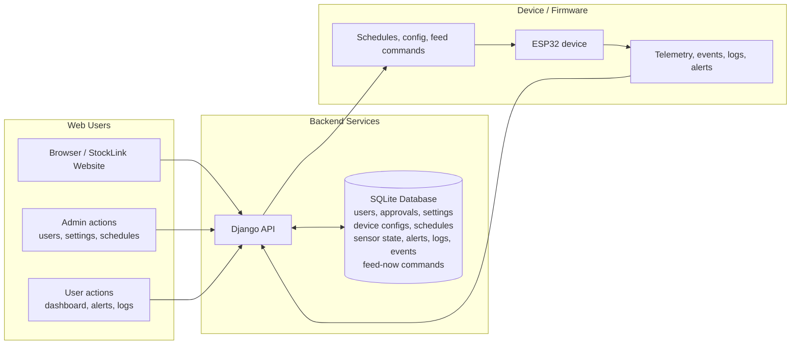

# StockLink Website Operations Manual

## Purpose

This manual explains the basic daily use of the StockLink website.

## System Data Flow Overview

This diagram shows that the database is the central store for the system state. The web app, admin tools, and device firmware do not communicate directly with each other; they exchange information through the Django API, which acts as the main coordination layer.

When a user signs in, updates a schedule, changes system settings, or reviews logs and alerts, the request goes from the browser to the API and then to the SQLite database. The database stores the long-term records for users, approvals, settings, device configurations, schedules, sensor state, events, alerts, logs, and feed-now commands. This means the database is not only a storage layer, but also the source of truth for what the website displays.

On the device side, the ESP32 publishes telemetry, event data, logs, and alert information to the API. The API saves that information in the database so it can be shown later in the dashboard, history pages, and alerts view. In the opposite direction, the API sends schedules, configuration updates, and feed-now commands back to the device. This keeps the website and the device synchronized and ensures that both sides work from the same stored data.

In practice, the diagram reflects the full lifecycle of system data: it is created or collected, sent to the API, stored in the database, and then read back by the website or device when needed.

## 1. Before You Start

Make sure you have:

- A StockLink account.
- A verified email address.
- A working internet connection.
- A web browser.

If you are an administrator, you can also update system settings and manage users.

## 2. Open the Website

1. Open your browser.
2. Go to the StockLink website.
3. Wait for the login page to load.

If the page does not open, check your internet connection.

## 3. Register a New Account

1. Click the Register option.
2. Enter your username.
3. Enter your email address.
4. Create a password.
5. Confirm the password.
6. Accept the terms if required.
7. Submit the form.

After registration, check your email and complete the verification step before logging in.

## 4. Log In

1. Enter your registered username or email address.
2. Enter your password.
3. Click Login.

If login fails, check that your account is verified and that your password is correct.

## 5. Recover Your Password

If you forget your password:

1. Click Forgot Password.
2. Enter the email address on your account.
3. Request the reset link.
4. Open the email sent to you.
5. Follow the reset link.
6. Set a new password.

## 6. Use the Dashboard

After logging in, the Dashboard shows the current status of the system.

In the Dashboard, you can:

- Check the feed level.
- Check the water level.
- Check whether the device is online.
- View active alerts.
- See the latest scheduled feeding information.

## 7. Use Schedule Management

1. Open Schedule Management from the side menu.
2. Click to add a new schedule.
3. Enter a schedule name.
4. Select the days it should run.
5. Set the feeding time.
6. Enter the feed amount.
7. Leave the schedule enabled if you want it to run automatically.
8. Save the schedule.

You can also edit, disable, or delete an existing schedule from the same section.

## 8. Check Notifications & Alerts

1. Open Notifications & Alerts from the side menu.
2. Review any active alerts.
3. Check whether the issue has been resolved.

Use this page to see problems such as low feed, low water, power issues, or battery warnings.

## 9. Review Feeding History

1. Open Feeding Logs / History from the side menu.
2. Review the list of feeding activity.
3. Move through older entries if needed.
4. Export the history if you need a copy for records.

## 10. Open System Settings

If you are an administrator:

1. Open System Settings from the side menu.
2. Review the current settings.
3. Change only the setting you want to update.
4. Save the changes.

Use this section to update items such as timezone, capacity settings, alert levels, and notification email addresses.

## 11. Manage Users

If you are an administrator:

1. Open Admin Users from the side menu.
2. Review new or existing users.
3. Approve users if needed.
4. Manage user roles if required.

## 12. Use the Account Menu

1. Open the user menu in the lower-left corner.
2. Change your password if needed.
3. Log out when you are finished.

If your account allows it, you may also delete your account from this menu.

## 13. Daily Use Checklist

Use this short checklist each day:

1. Log in to the website.
2. Check the Dashboard.
3. Review Alerts.
4. Confirm the schedules are correct.
5. Check the feeding history if needed.
6. Update settings only if you are authorized.

## 14. When to Get Help

Get help if:

- You cannot log in.
- The device stays offline.
- A schedule does not run.
- Alerts keep returning.
- You cannot change a setting that should be available to you.
