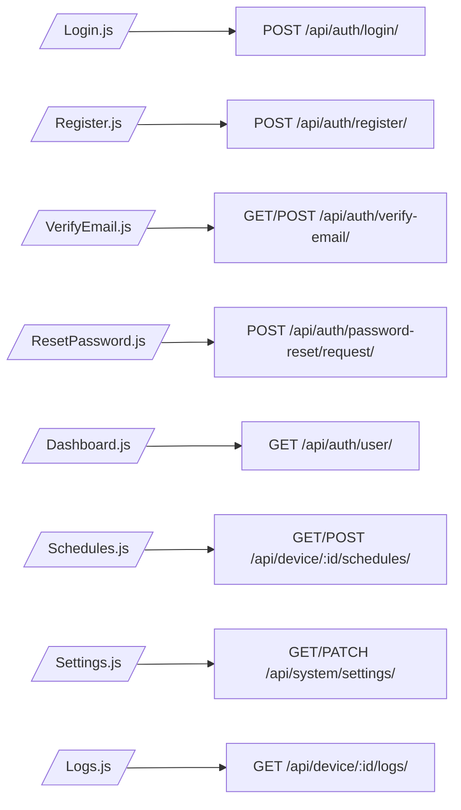
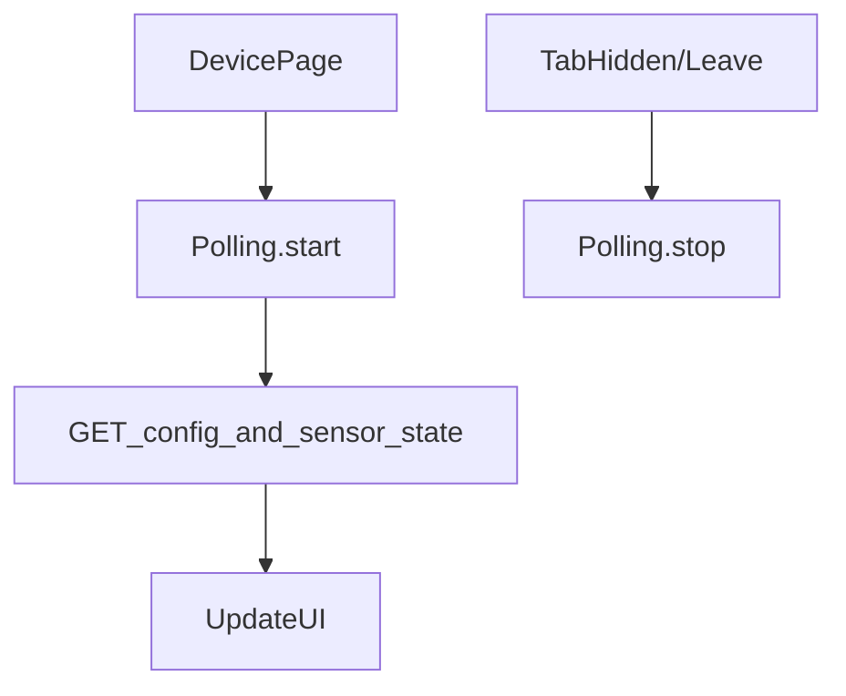

# Frontend Flow Chart

This document maps the React frontend control flow for the SPA in this workspace. It documents the route/page structure, key components, authentication and API interaction patterns, polling/refresh strategies, and UI-driven admin/device actions.

## 1. High-level SPA map

```mermaid
flowchart TD
  A[Browser user] --> B[index.html + React App]
  B --> C[App.js router]
  C --> D[Public pages: Login, Register, VerifyEmail, ResetPassword]
  C --> E[Protected routes: Dashboard, Devices/Schedules, Logs, Settings, AdminUsers]
  E --> F[Sidebar + Header compose layout]
  F --> G[Page content components]
  G --> H[Modals and overlays (AddScheduleModal, etc.)]
```

Notes:
- The SPA is served by Django for non-/api/ routes and then React client-side routing (in `App.js`) controls view changes.

## 2. Route & Page responsibilities



Notes:
- Pages call the `src/api.js` helpers to send requests to the `/api/` namespace.
- Protected pages require a valid authenticated session (cookie-based session auth) as configured by the Django REST framework settings.

## 3. Auth/session flow in the frontend

```mermaid
flowchart TD
  A[Login form submit] --> B[api.login(identity,password)]
  B --> C[API /api/auth/login -> sets session cookie]
  C --> D[On success: store minimal access state in app store/context]
  D --> E[Redirect to Dashboard]

  F[Logout button] --> G[api.logout POST /api/auth/logout/]
  G --> H[Clear app auth state and redirect to Login]

  I[Registration submit] --> J[api.register]
  J --> K[Backend sends verification email]

  L[App init] --> M[api.currentUser GET /api/auth/user/]
  M -- authenticated --> N[hydrate app user state]
  M -- unauthenticated --> O[show public routes]
```

Notes:
- The frontend relies on session cookies; no separate token handling is implemented client-side.

## 4. API interaction patterns and error handling

- All API calls go to `src/api.js` which centralizes fetch/axios calls and common error handling.
- API responses that indicate authentication errors (401/403) trigger a global logout or redirect to Login.
- Form validation errors from the backend are surfaced inline in the relevant forms.

```mermaid
flowchart LR
  Component --> API_Helper[src/api.js]
  API_Helper --> Fetch[/fetch()/axios/]
  Fetch --> Backend[/Django /api/ endpoints/]
  Backend -- 200 --> Component.successHandler
  Backend -- 4xx/5xx --> Component.errorHandler
  Component.errorHandler --> UI.displayError
```

## 5. Device interactions and polling

- The frontend displays device state (sensor readings, feed-now status, schedules) by calling device endpoints such as `GET /api/device/:id/config/`, `GET /api/device/:id/sensor-state/`, `GET /api/device/:id/logs/`.
- `src/pollingConfig.js` drives periodic fetches for dashboards or device detail views. Typical strategy:
  - Poll every N seconds for sensor-state and config updates while the device detail view is open.
  - Cancel polling when the user navigates away or the tab is hidden.



Notes:
- Polling intervals and backoff are configured in `pollingConfig.js` and should respect user visibility and network constraints.

## 6. Feed-now command lifecycle (UI perspective)

```mermaid
flowchart TD
  AdminClicksFeedNow --> UI_ShowFeedNowModal
  UI_ShowFeedNowModal --> SubmitAmount
  SubmitAmount --> api.post /api/device/:id/feed-now/
  POST -> Backend validates; creates FeedNowCommand (pending)
  Backend -> Response with command row
  Device polls config -> sees `config.feed_now_command` -> executes
  Device POST /api/device/:id/feed-now/{id}/ack -> Backend updates command status
  Frontend polling GET /api/device/:id/feed-now/ -> Shows updated status
```

## 7. Schedules UI flow

- Add/edit/delete schedule actions call `Schedules.js` which uses `ScheduleListCreateView` and `ScheduleDetailView` endpoints.
- After any schedule mutation, the frontend refreshes device config view so the derived `config.schedules` is in sync.

## 8. Component responsibilities (quick index)

- `App.js`: Router, protected route wrapper, top-level context/providers.
- `api.js`: Centralized API helper for requests and error handling.
- `pollingConfig.js`: Polling intervals and helpers to start/stop polling.
- `Header.js` / `Sidebar.js`: Navigation, global actions (logout), status badges.
- `AddScheduleModal.js`: Create schedule form, submits to `/api/device/:id/schedules/`.
- `Dashboard.js`: Aggregates device list, recent logs, alert counts, and quick actions.
- `DeviceDetail` (page): Shows config, sensor state, logs, schedule editor, and feed-now controls.

## 9. Build & deployment notes

- During development the React app runs standalone, but the production build is placed under `frontend/build/` and served by Django's static files.
- Keep CORS and session cookie settings aligned between frontend origin and Django to preserve authentication when running separately.

## 10. Files to inspect for implementation details

- [frontend/src/App.js](src/App.js)
- [frontend/src/index.js](src/index.js)
- [frontend/src/api.js](src/api.js)
- [frontend/src/pollingConfig.js](src/pollingConfig.js)
- [frontend/src/pages/Login.js](src/pages/Login.js)
- [frontend/src/pages/Register.js](src/pages/Register.js)
- [frontend/src/pages/Dashboard.js](src/pages/Dashboard.js)
- [frontend/src/pages/Schedules.js](src/pages/Schedules.js)
- [frontend/src/components/AddScheduleModal.js](src/components/AddScheduleModal.js)

---

If you want, I can (pick one):
- add inline links to the exact lines in the files above,
- generate a compact printable PDF of these diagrams,
- or add a simplified one-page SVG diagram suitable for presentations.
