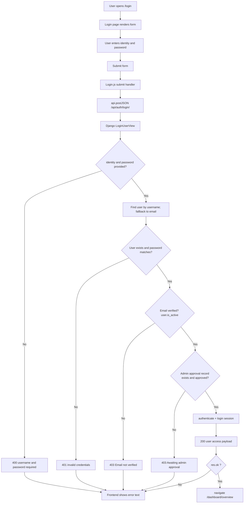
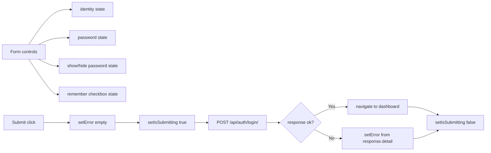
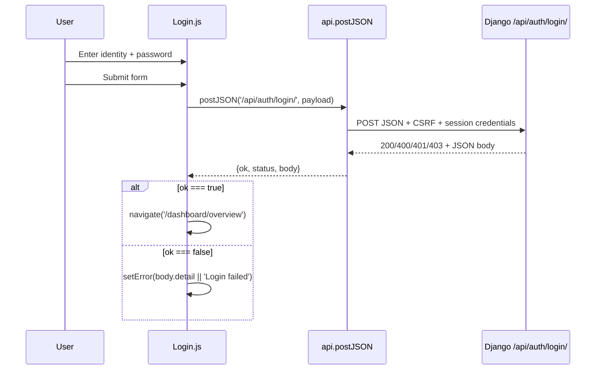

# User Login Flowchart

This document focuses only on the user login flow, from form input in the React app to authentication decisions in the Django backend.

## 1. End-to-end login flow

## 2. Frontend login state flow (`src/pages/Login.js`)

Notes:
- The button is disabled while submitting, and displays `Logging in...`.
- Error messages are displayed through `auth-error` when backend returns non-OK responses.

## 3. Request/response sequence diagram

## 4. Backend login decision table

| Condition | Backend response | Frontend behavior |
| --- | --- | --- |
| Missing identity or password | 400 | Show returned detail as error |
| Wrong credentials | 401 | Show returned detail as error |
| Not email verified | 403 | Show returned detail as error |
| Not admin approved | 403 | Show returned detail as error |
| Valid and approved user | 200 | Redirect to dashboard |

## 5. Source files for this flow

- [frontend/src/pages/Login.js](src/pages/Login.js)
- [frontend/src/api.js](src/api.js)
- [server/iot/views.py](../server/iot/views.py)
