# Server Flow Chart

This document maps the server-side control flow for the Django backend in this workspace. It is organized from bootstrapping to request routing, then into the major functional paths that the server owns: authentication, admin/user management, device registration and synchronization, telemetry ingestion, alerts/logs, and background monitoring.

## 1. High-Level Server Map

```mermaid
flowchart TD
    A[Process start] --> B[manage.py sets DJANGO_SETTINGS_MODULE]
    B --> C[server.settings loads Django config]
    C --> D[iot app is installed]
    D --> E[iot.apps.IotConfig.ready()]
    E --> F[Register signals]
    E --> G[Start device connection monitor thread]

    H[Browser / React SPA] --> I[server.urls]
    J[ESP32 device] --> I
    K[Admin or staff user] --> I

    I --> L[Admin route /admin/]
    I --> M[API route /api/]
    I --> N[SPA fallback to index.html]

    M --> O[Auth and user routes]
    M --> P[System settings route]
    M --> Q[Device registration and device list]
    M --> R[Device config, schedules, sensor state, events]
    M --> S[Logs and alerts]
    M --> T[Feed-now command flow]
    M --> U[Admin user moderation]

    G --> V[Periodic check_device_connections command]
    V --> W[Mark stale devices disconnected]
    W --> X[Create connection logs and alerts]
```

### What this means

- `manage.py` is the process entrypoint for Django commands, development server startup, and management tasks.
- `server.settings` wires the app together, enables CORS, session auth, REST framework, the `iot` app, static file serving for the React build, and the timezone middleware.
- `IotConfig.ready()` is important because it activates two background behaviors at startup: signal registration and the device connection monitor thread.
- `server.urls` routes the root and all non-API URLs to the React SPA, while `/api/` is reserved for the backend API.

## 2. Startup and Request Plumbing

```mermaid
flowchart LR
    A[manage.py main()] --> B[set default settings module]
    B --> C[execute_from_command_line]
    C --> D[Django boots]
    D --> E[Installed apps loaded]
    E --> F[iot.apps.IotConfig.ready]
    F --> G[signals imported]
    F --> H[connection_monitor thread started]
    H --> I[call_command check_device_connections every interval]

    D --> J[Middleware stack]
    J --> K[SecurityMiddleware]
    J --> L[SessionMiddleware]
    J --> M[SystemTimezoneMiddleware]
    J --> N[CommonMiddleware]
    J --> O[CsrfViewMiddleware]
    J --> P[AuthenticationMiddleware]
    J --> Q[MessageMiddleware]
    J --> R[XFrameOptionsMiddleware]
    J --> S[CorsMiddleware]

    M --> T[Read timezone from SystemSettings]
    T --> U[timezone.activate before request]
    U --> V[Request handled]
    V --> W[timezone.deactivate after response]
```

### Purpose of each layer

- `SystemTimezoneMiddleware` ensures server-side time logic uses the database-configured timezone rather than only the process default.
- The connection monitor is a daemon thread that repeatedly runs the stale-device checker without waiting for user traffic.
- CORS is enabled for frontend integration during development, and the React build is served from the backend build path.

## 3. Public Web and SPA Routing

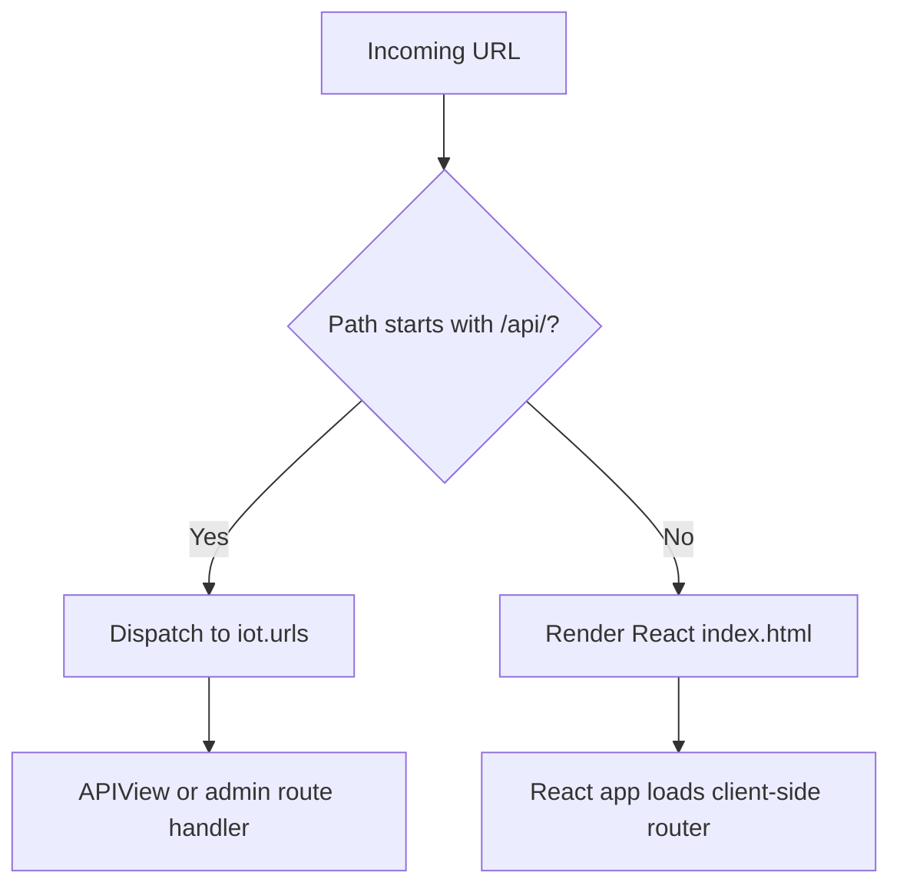

### Purpose

- The backend serves both the API and the frontend shell.
- Any non-API path falls back to the SPA entrypoint, which lets the React router handle client-side navigation.

## 4. Authentication and User Account Flow

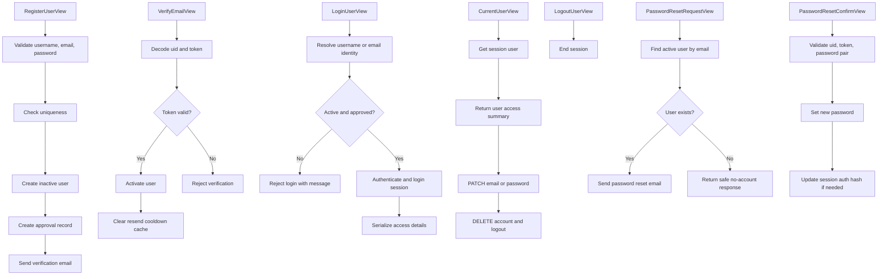

### What this path does

- Registration creates a new account, but the user remains inactive until email verification succeeds.
- Login is deliberately conservative: the user must exist, have a valid password, be email-verified, and pass the admin approval gate.
- Password reset is split into request and confirm steps so the backend can send a tokenized reset link and later verify it before changing the password.
- `CurrentUserView` is both a profile read endpoint and a small account-management endpoint for email and password updates.

## 5. Admin and Staff Moderation Flow

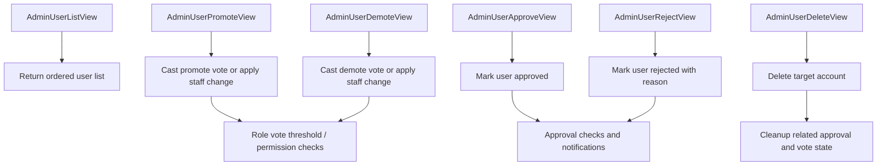

### Purpose

- The backend treats web users separately from device identities.
- Admin endpoints handle approval, promotion, demotion, and deletion of user accounts.
- Role changes are guarded so the server can enforce local policy rather than trusting the frontend.

## 6. System Settings and Device Configuration

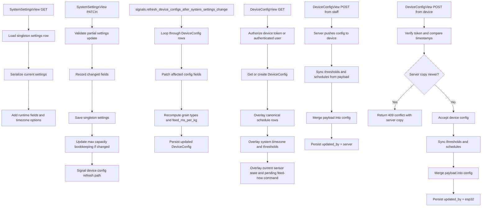

### Why this part exists

- `SystemSettings` is the global source of truth for thresholds, grain profile, capacity, recipients, and SMTP settings.
- `DeviceConfig` is the per-device projection that combines global defaults with device-specific state.
- The backend always reattaches canonical schedule rows and derived fields so devices do not drift from the database truth.

## 7. Device Registration and Device Inventory

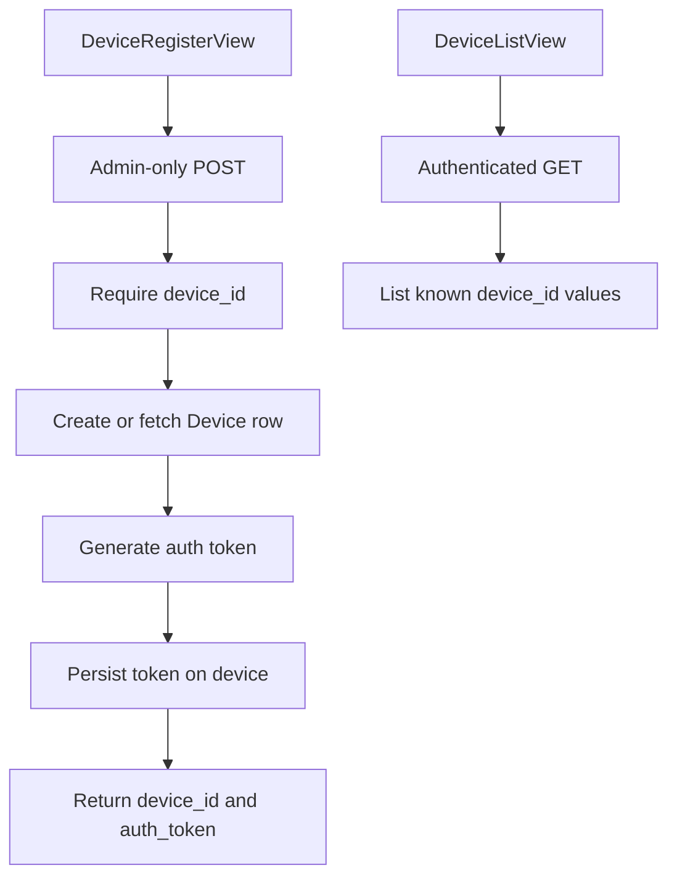

### Purpose

- Device registration is an admin-controlled setup step.
- The device inventory endpoint supports the web UI by listing all known device identifiers.

## 8. Schedule Synchronization

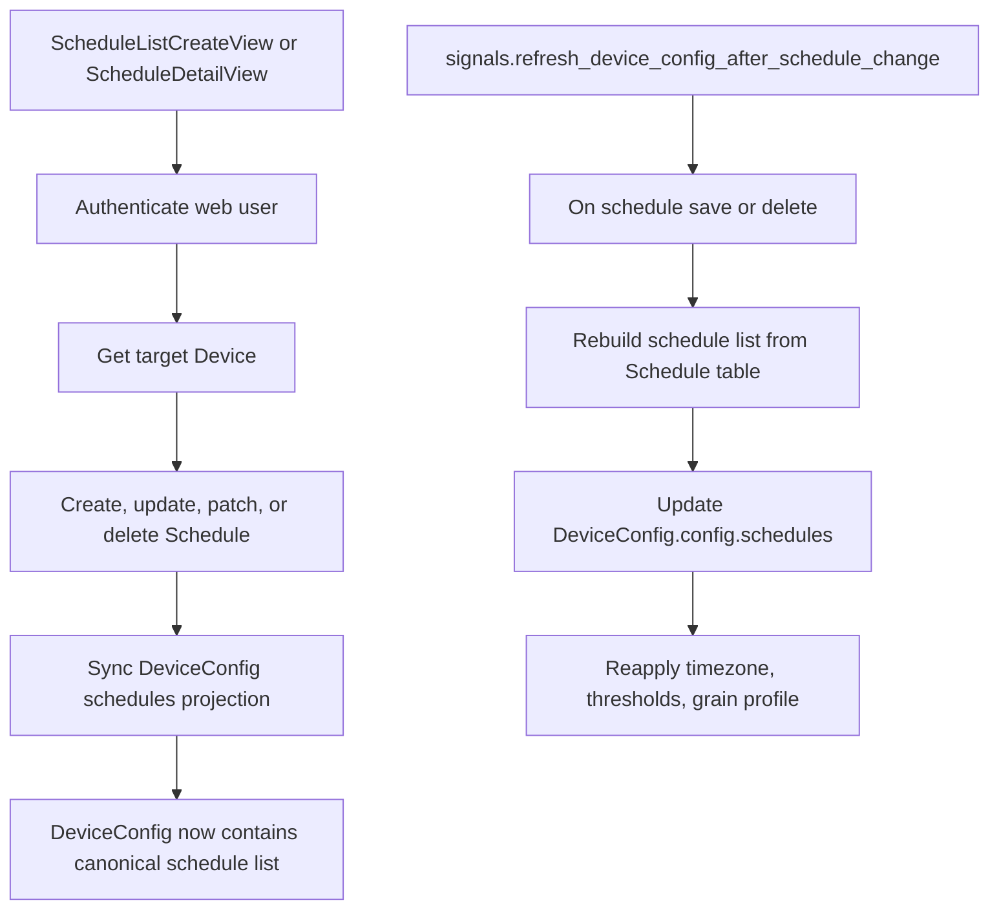

### Purpose

- Schedule rows are the canonical source.
- `DeviceConfig.config.schedules` is a derived projection, not the authoritative schedule store.
- Whenever schedules change, the server rewrites the config projection so devices can fetch a single coherent config document.

## 9. Telemetry, Logs, and Events

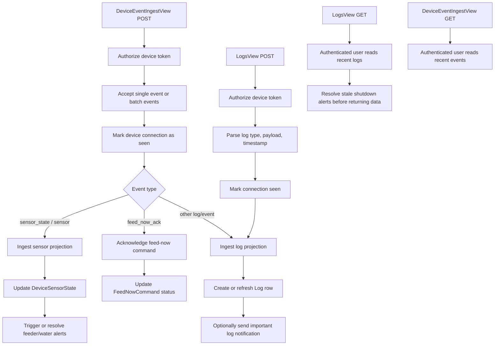

### What happens in practice

- The device can send either a single event or a batch of events.
- The server routes sensor readings to the sensor-state projection, feed acknowledgements to the pending command row, and everything else to logs.
- Reads of logs and alerts also act as a cleanup point for stale shutdown alerts.

## 10. Sensor State and Auto-Alert Logic

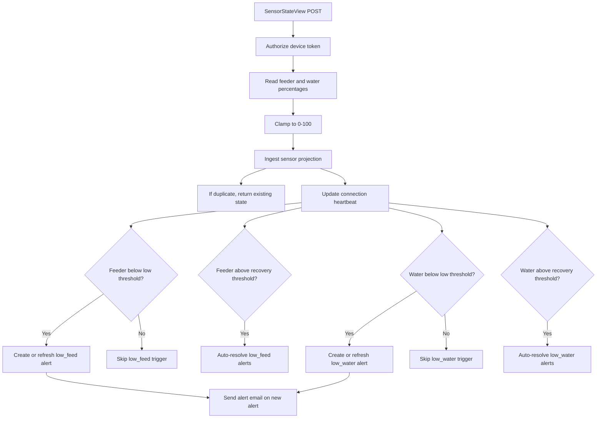

### Purpose

- Sensor reads are not just stored; they immediately drive alert creation, alert refreshes, and alert resolution.
- The server uses hysteresis by separating trigger thresholds from recovery thresholds.

## 11. Alert Flow

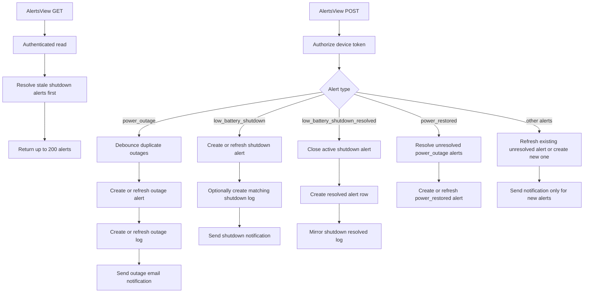

### Purpose

- Alerts are stateful records, not single events.
- The server distinguishes between a first occurrence, a refresh of the same unresolved alert, and a resolution event.
- Power outage and low-battery shutdown are handled specially because they also create matching logs and follow debounce / resolution rules.

## 12. Feed-Now Command Flow

```mermaid
flowchart TD
    A[FeedNowCommandView GET] --> B[Authenticated user reads pending and recent commands]

    C[FeedNowCommandView POST] --> D[Staff user only]
    D --> E[Validate requested amount]
    E --> F[Compare against max feed capacity]
    F --> G{Pending command limit reached?}
    G -- Yes --> H[Reject with conflict]
    G -- No --> I[Create pending FeedNowCommand]
    I --> J[Device polls or receives config containing pending command]

    K[FeedNowAcknowledgeView POST] --> L[Authorize device token]
    L --> M[Validate executed or failed status]
    M --> N[Mark device connection seen]
    N --> O[Update command status]
    O --> P[Return updated command payload]

    Q[DeviceEventIngestView batch ack] --> O
```

### Purpose

- Staff users create feed-now commands, while the device acknowledges execution or failure.
- The command limit prevents the server from stacking too many unacknowledged requests.

## 13. Background Monitoring and Recovery

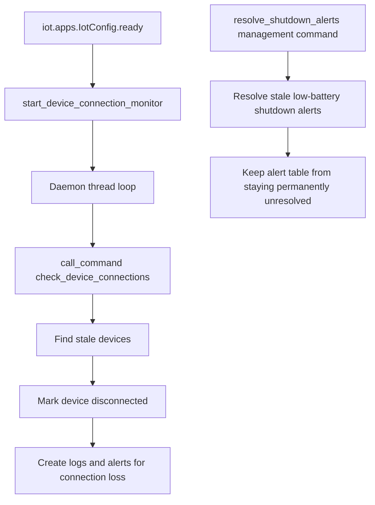

### Purpose

- The server does not rely only on incoming traffic to maintain state.
- A connection monitor continuously evaluates device liveness.
- A separate cleanup command resolves stale shutdown alerts after the configured grace period.

## 14. Core Data Model Roles

| Model | Role in the server |
| --- | --- |
| Device | Identity record for each ESP32 or hardware endpoint, including token and connection state. |
| DeviceConfig | Per-device merged configuration returned to devices and the frontend. |
| Schedule | Canonical schedule table for each device. |
| Alert | Stateful alert records with refresh and resolution behavior. |
| Log | Log history, including refreshed current rows for many log types. |
| DeviceEvent | Deduplicated event stream for device-originated actions and telemetry. |
| SystemSettings | Singleton global settings source for thresholds, grain profiles, SMTP, and alert recipients. |
| DeviceSensorState | Latest feeder and water sensor projection. |
| FeedNowCommand | Pending or completed feeding commands from staff to device. |
| UserApproval | Separate approval gate for frontend users. |
| AdminRoleVote | Tracks staff/admin role voting actions. |

## 15. How the Pieces Fit Together

1. The server starts, loads the `iot` app, registers signals, and launches the stale-connection monitor.
2. The middleware activates the current timezone from the database before each request.
3. The root URL serves the SPA, while `/api/` routes into the backend API.
4. Web users go through registration, email verification, approval, login, and profile management.
5. Admin users manage global system settings and moderate other users.
6. Devices authenticate with token headers and interact with config, logs, alerts, sensor state, and command acknowledgment endpoints.
7. Signals and background jobs keep per-device config projections, liveness state, and shutdown alert cleanup synchronized over time.

## 16. Files That Control This Flow

- [manage.py](manage.py)
- [server/settings.py](server/settings.py)
- [server/urls.py](server/urls.py)
- [iot/apps.py](iot/apps.py)
- [iot/middleware.py](iot/middleware.py)
- [iot/signals.py](iot/signals.py)
- [iot/connection_monitor.py](iot/connection_monitor.py)
- [iot/views.py](iot/views.py)
- [iot/models.py](iot/models.py)
- [iot/serializers.py](iot/serializers.py)
