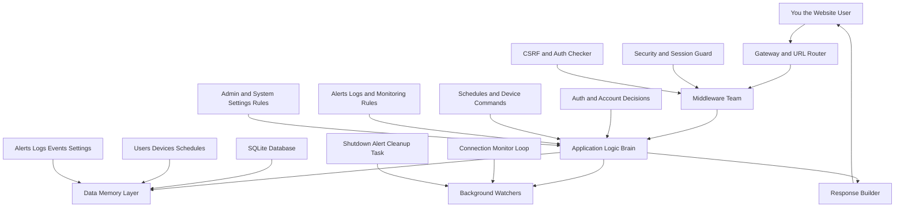
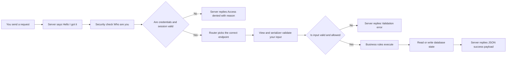
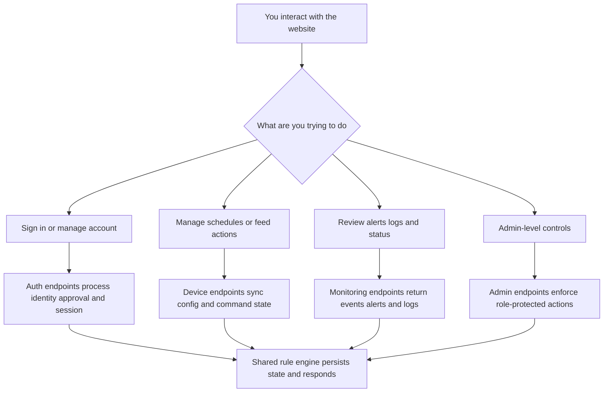
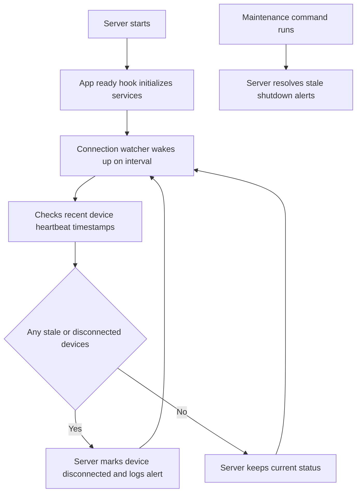

# Server High-Level Flowchart (User Perspective)

This map describes the server as if you are talking to it while you use the website.

## 1. Big Picture: "I request, the server decides, the system acts"

## 2. What Happens To Your Request Inside the Server

## 3. High-Level Domain Journey From Your Perspective

## 4. Server Side Processes Running Even When You Are Idle

## 5. Human-Style Summary

- You ask for an action through the frontend.
- The server verifies who you are, validates your request, applies system rules, updates data, and responds.
- In parallel, background watchers keep device health and alert state accurate even without user traffic.
